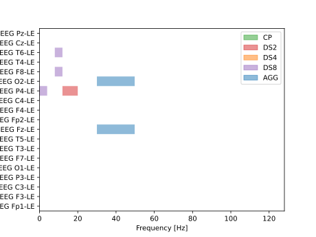
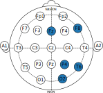

# Effective EEG Feature Selection for Interpretable MDD (Major Depressive Disorder) Classification
[](https://doi.org/10.1145/3583131.3590398)

_In this work, we propose an interpretable electroencephalogram (EEG)-based solution for the diagnostics of major depressive disorder (MDD). The acquisition of EEG experimental data involved 32 MDD patients and 29 healthy controls. A feature matrix is constructed involving frequency decomposition of EEG data based on power spectrum density (PSD) using the Welch method. Those PSD features were selected which were statistically significant. To improve the interpretability, the best features are first selected from features space via the non-dominated sorting genetic (NSGA-II) evolutionary algorithm. The best features are utilized for support vector machine (SVM), and k-nearest neighbors (k-NN) classifiers, and the results are then correlated with features to improve the interpretability. The results show that the features (gamma bands) extracted from the left temporal  brain regions can distinguish MDD patients from control significantly._


# Reference
If you use this work, please refernce a following paper, where you can find more details.


```
Vojtech Mrazek, Soyiba Jawed, Muhammad Arif, and Aamir Saeed Malik.
2023. Effective EEG Feature Selection for Interpretable MDD (Major Depressive Disorder) Classification. In Genetic and Evolutionary Computation
Conference (GECCO ’23), July 15–19, 2023, Lisbon, Portugal. ACM, New York,
NY, USA, 9 pages. https://doi.org/10.1145/3583131.3590398
```


# Environment
We used Anaconda to setup the enviroment. All required modules are located in environment.yml
```bash
conda env create -f environment.yml
```

Basically, this project uses MNE, SciPy and Py-ParetoArchive libraries.

# Data preparation
Download all Eyes-open data (EO suffix) data from
https://figshare.com/articles/dataset/EEG_Data_New/4244171

to the folder `data/MDD`. Keep only the files ending by `_EO.edf`. The labels of the subject are determined by the filename. 

# Running
The scripts are run consequently. Hereby we provide a short description of the scripts.

## 01_create_data.py
Runs the Welsh filter and stores the numpy arrays to the cache folder

## 02_standard_classifier.py
Example of standard classifier on the selected data. Just for testing puposes

## 03_ga_features_selector.py
The core script that uses NSGA-II algorithm to find a correct feature extractors.

## 05_* and 06_*
Analysis scripts, just as example.

# galib library
This library provides an abstraction of chromosome. Chromose class provides a function `extract`, that selects the precalculated Welsh-filter outputs from the cache. It also provides visulazation functions

## Visualize
```py

chrom = ChromosomeChannels(ga_ops)
chrom.from_str('(EEG O2-LE, 30.0, 49.75, AGG)(EEG F8-LE, 8.0, 12.0, DS8)(EEG T6-LE, 8.0, 12.0, DS8)(EEG P4-LE, 12.0, 20.0, DS2)(EEG Fz-LE, 30.0, 49.75, AGG)(EEG P4-LE, 0.0, 4.0, DS8)')
ax = chrom.vizualize() # axis object

plt.savefig("plot.svg")
```



## Topological view
```py
from galib import ChromosomeChannels
chrom = ChromosomeChannels(ga_ops)
chrom.from_str('(EEG O2-LE, 30.0, 49.75, AGG)(EEG F8-LE, 8.0, 12.0, DS8)(EEG T6-LE, 8.0, 12.0, DS8)(EEG P4-LE, 12.0, 20.0, DS2)(EEG Fz-LE, 30.0, 49.75, AGG)(EEG P4-LE, 0.0, 4.0, DS8)')

head = chrom.plot_head("tab:blue") # returns pyplot axis
ax.savefig("head.svg")
```




or you can sen your own color.

```py
from galib import EEGschema
sch = EEGschema()
cm = plt.get_cmap("viridis")
for ch, c in zip(chrom1.ops.channels, stat_chan):
    #print(ch, c)
    sch.set_channel_color(ch.replace(
        "EEG ", "").replace("-LE", "").lower(), cm(c))

sch.savefig(f"usage_{cl}.svg")
```